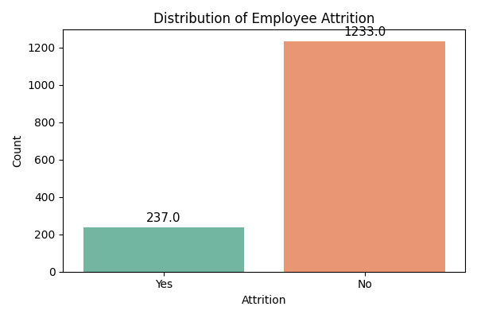
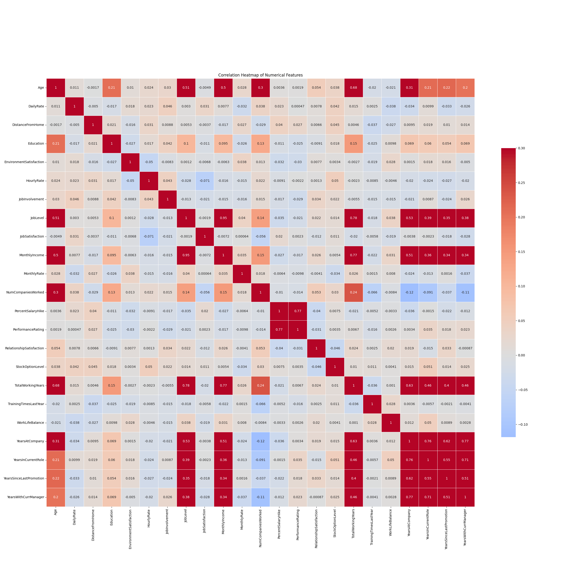
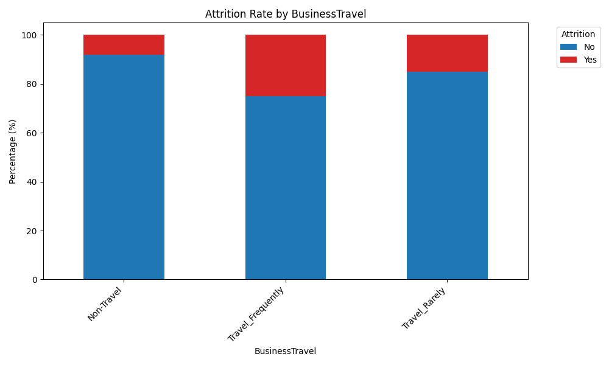

# 📊 Employee Attrition Analysis & Insight Engine

<div align="center">


**A modular, interpretability-focused data analytics system for predicting and understanding employee attrition.**  
Built with Python · Streamlit · Scikit-Learn · ReportLab

</div>

---

## 🎯 Project Overview

Employee attrition is one of the most costly challenges for organizations. This project provides a **full-stack data analytics dashboard** that moves beyond simple model accuracy — it focuses on generating **actionable, human-readable business insights** from the [IBM HR Analytics Employee Attrition Dataset](https://www.kaggle.com/datasets/pavansubhasht/ibm-hr-analytics-attrition-dataset).

The system covers the **full analytics pipeline**:

| Stage | Description |
|---|---|
| 🔍 **Data Overview** | Load, clean, and preview the HR dataset |
| 📈 **Exploratory Data Analysis** | Distribution plots, heatmaps, and categorical breakdowns |
| 📐 **Statistical Testing** | T-Tests for numerical & Chi-Square for categorical features |
| 🤖 **ML Insights** | Logistic Regression with interpretable feature coefficients |
| 📄 **PDF Report** | Auto-generated, downloadable professional report via ReportLab |

---

## ✨ Key Features

- **Interactive Streamlit Dashboard** — Multi-page navigation with sidebar controls
- **Automated Insight Engine** — Converts statistical outputs into plain-English business insights
- **Statistical Significance Testing** — T-Tests and Chi-Square tests to identify the true drivers of attrition
- **Interpretable ML Model** — Logistic Regression with Odds Ratio analysis (not just accuracy)
- **One-Click PDF Report** — Compiles all findings, charts, and insights into a downloadable PDF
- **Custom Dataset Upload** — Supports uploading your own HR CSV dataset directly in the UI

---

## 🖼️ Dashboard Preview

| EDA — Attrition Distribution | Correlation Heatmap | Categorical vs. Attrition |
|:---:|:---:|:---:|
|  |  |  |

---

## 🗂️ Project Structure

```
Empolyee_Attrition_Project_FDA/
│
├── app.py                      # Main Streamlit dashboard application
├── requirements.txt            # All required Python dependencies
├── README.md                   # Project documentation (this file)
│
├── data/
│   └── WA_Fn-UseC_-HR-Employee-Attrition.csv   # IBM HR dataset
│
├── src/
│   ├── preprocessing.py        # Data loading, cleaning & ML encoding
│   ├── eda.py                  # Matplotlib/Seaborn visualization functions
│   ├── statistics.py           # T-Test & Chi-Square significance testing
│   ├── ml_model.py             # Logistic Regression training & evaluation
│   ├── insight_engine.py       # Automated natural-language insight generator
│   └── report_generator.py     # PDF report compilation using ReportLab
│
└── images/
    ├── attrition_dist.png      # Auto-saved EDA chart
    ├── heatmap.png             # Auto-saved correlation heatmap
    └── cat_vs_attrition.png    # Auto-saved categorical chart
```

---

## 🛠️ Tech Stack

| Library | Purpose |
|---|---|
| `streamlit` | Interactive web dashboard |
| `pandas` | Data manipulation & analysis |
| `numpy` | Numerical computing |
| `matplotlib` & `seaborn` | Data visualization |
| `scipy` | Statistical hypothesis testing (T-Test, Chi-Square) |
| `scikit-learn` | Logistic Regression model & preprocessing |
| `reportlab` | Automated PDF report generation |

---

## 🚀 Getting Started

### Prerequisites

- **Python 3.9 or higher** — [Download here](https://www.python.org/downloads/)
- **Git** — [Download here](https://git-scm.com/)

### 1. Clone the Repository

```bash
https://github.com/Divyansh-Parihar/Employee-Attrition-Analysis.git
cd Employee-Attrition-Analysis
```

### 2. Create a Virtual Environment

```bash
python -m venv venv
```

### 3. Activate the Virtual Environment

**Windows (Command Prompt / PowerShell):**
```bash
.\venv\Scripts\activate
```

**macOS / Linux:**
```bash
source venv/bin/activate
```

### 4. Install Dependencies

```bash
pip install -r requirements.txt
```

### 5. Add the Dataset

Download the IBM HR Attrition dataset from [Kaggle](https://www.kaggle.com/datasets/pavansubhasht/ibm-hr-analytics-attrition-dataset) and place the CSV file inside the `data/` folder:

```
data/WA_Fn-UseC_-HR-Employee-Attrition.csv
```

> **Tip:** You can also skip this step and upload your own CSV directly through the dashboard's sidebar.

### 6. Run the Dashboard

```bash
streamlit run app.py
```

The app will open automatically in your browser at **[http://localhost:8501](http://localhost:8501)** 🎉

---

## 📋 Dashboard Pages

### 1️⃣ Data Overview
- Preview of the cleaned dataset (first 10 rows)
- Total employees, feature count, and overall attrition rate metric

### 2️⃣ Exploratory Data Analysis
- **Attrition Distribution** — Count and proportion of employees who left
- **Numerical Feature Distributions** — Interactive dropdown to select any numerical column
- **Categorical Features vs. Attrition** — Side-by-side grouped bar charts
- **Correlation Heatmap** — Visual matrix of feature correlations

### 3️⃣ Statistical Findings
- Automated business insights generated from statistical test results
- **T-Test results** for all numerical features
- **Chi-Square results** for all categorical features
- Sorted by statistical significance (p-value)

### 4️⃣ ML Insights
- Logistic Regression model trained on the preprocessed dataset
- Model accuracy displayed on success
- Top feature coefficients (Odds Ratios) shown in an interpretable table
- Key drivers of attrition ranked and explained in plain English

### 5️⃣ Generate PDF Report
- One-click report generation
- Compiles all insights, statistics, and charts into a professional PDF
- Instant in-browser download button

---

## 🧪 Running Tests

A basic test script is included to verify that core modules load correctly:

```bash
python test.py
```

---

## 🙏 Acknowledgements

- **Dataset**: [IBM HR Analytics Employee Attrition & Performance](https://www.kaggle.com/datasets/pavansubhasht/ibm-hr-analytics-attrition-dataset) via Kaggle
- **Framework**: [Streamlit](https://streamlit.io/) for the interactive dashboard
- **Inspiration**: Interpretability-first machine learning in HR analytics

---

<div align="center">
  Made with ❤️ for data-driven HR decision making
</div>
